---

_Progetto creato da **Andrea De Lorenzis**, **329975**_

---

# Budget Buddy: Applicazione per la finanza personale

## Presentazione
BudgetBuddy è un'applicazione per la gestione personale delle finanze sviluppata come
progetto durante il corso di "Programmazione di Dispositivi Mobili e Interfacce Utente" dell'Università di Urbino. 
L'obiettivo principale dell'app è fornire agli utenti uno strumento semplice ma efficace per
monitorare e gestire le proprie finanze quotidiane. E' disponibile su piattaforme Android e Web.

Le principali funzionalità offerte dall'app sono:
+ **Gestione delle transazioni:** l'utente può registrare le proprie transazioni, categorizzando 
spese e depositi, aiutandolo a tenere traccia delle uscite e delle entrate in modo ordinato.
+ **Analisi visuale dei movimenti:** tramite alcuni grafici l'utente può visualizzare la categorizzazione 
delle transazioni, offrendo una panoramica chiara delle abitudini di spesa.
+ **Pianificazione finanziaria:** l'app permette di creare un piano finanziario su uno specifico arco 
temporale, consentendo di calcolare il bilancio previsto e i profitti mese per mese.

---

## Casi d'uso
1. Un utente, Mario, utilizza BudgetBuddy per registrare le sue spese quotidiane e le entrate. Inserisce
 i dettagli di ogni transazione, come l'affitto, la spesa al supermercato o il pagamento delle bollette. 
Può anche decidere di rendere le transazioni fisse, in modo che in corrispondenza di una certa data queste
vengano inserite automaticamente.
2. Alla fine del mese, Mario accede ai grafici dell'app per vedere un riepilogo di tutte le transazioni, confrontandolo 
con i riepilogi dei mesi precedenti. Scopre di spendere molto in pasti fuori casa e decide di ridurre queta voce di spesa
per il mese successivo.
3. Mario vuole risparmiare per un viaggio. Utilizza la funzione di pianificazione finanziaria per visualizzare la 
situazione finanziaria nei prossimi sei mesi. Inserisce il suo bilancio iniziale e stima le spese e i depositi mensili. 
L'app calcola quanto Mario sarà in grado di risparmiare ogni mese, e quale sarà il suo bilancio alla fine del periodo, aiutandolo
 a raggiungere il suo obiettivo.

---
## Esperienza utente
### Splash Screen
Lo splash screen è la prima cosa che vedono gli utenti quando aprono l'applicazione. Sfrutta il tempo di caricamento
dell'app per mostrare un logo di branding.

  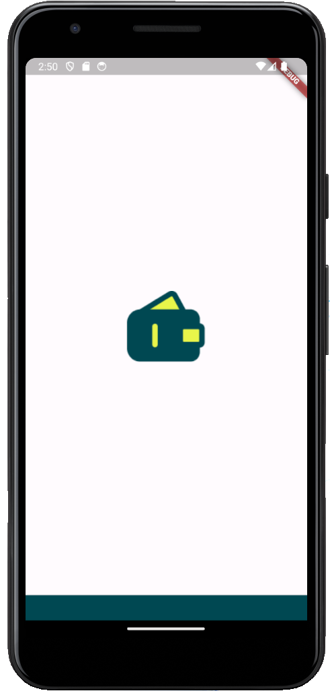

### Autenticazione
Se la sessione di autenticazione dell'utente è scaduta, questo viene portato alla pagina di "Sign In" in cui può riautenticarsi. 
Se è la prima volta che l'utente accede all'app, deve dirigersi alla pagina di "Sign Up", per creare un nuovo account. Se l'utente si era precedentemente autenticato, ma non ricorda le proprie
credenziali, può richiedere un reset della password via email tramite l'apposita pagina.

  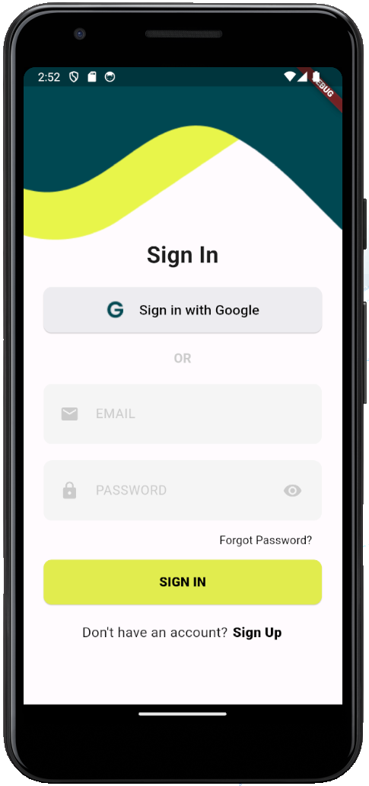
  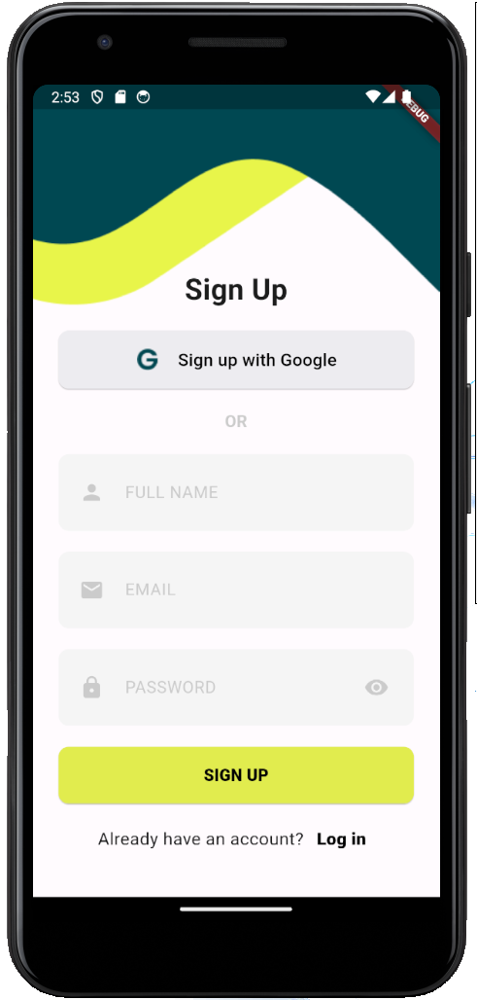
  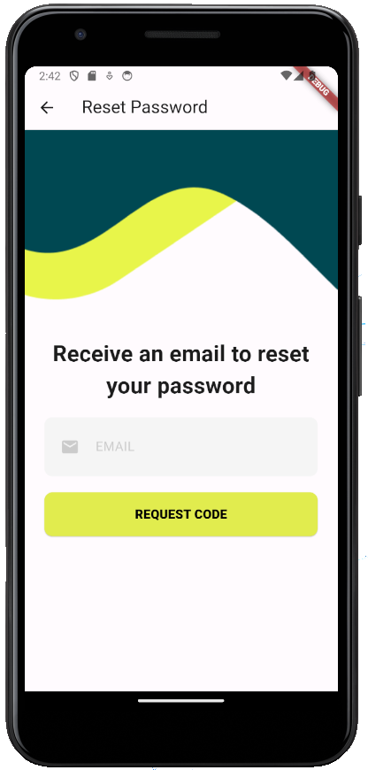

 
### Registro transazioni
Una volta effettuato l'accesso all'applicazione, si viene portati alla pagina "History", che mostra lo storico delle transazioni eventualmente aggiunte dall'utente
. Qui l'utente può aggiungere una nuova transazione tramite l'apposito pulsante in basso a destra. Oppure, premendo a lungo su una delle transazioni, entrerà nella modalità di
 selezione, in cui potrà selezionare una transazione da modificare o più transazioni da eliminare. 

  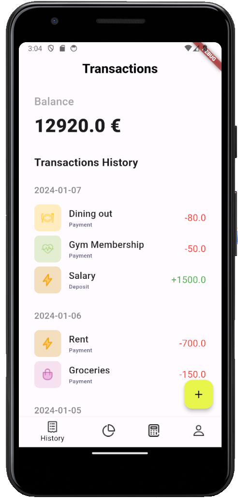
  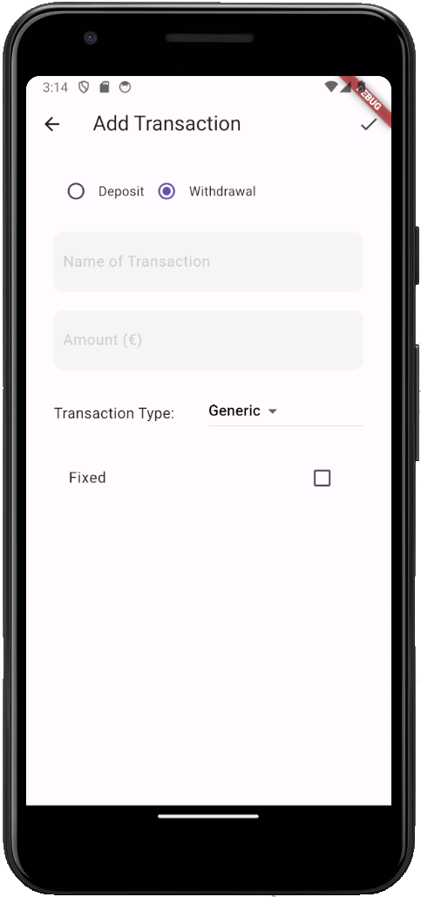
  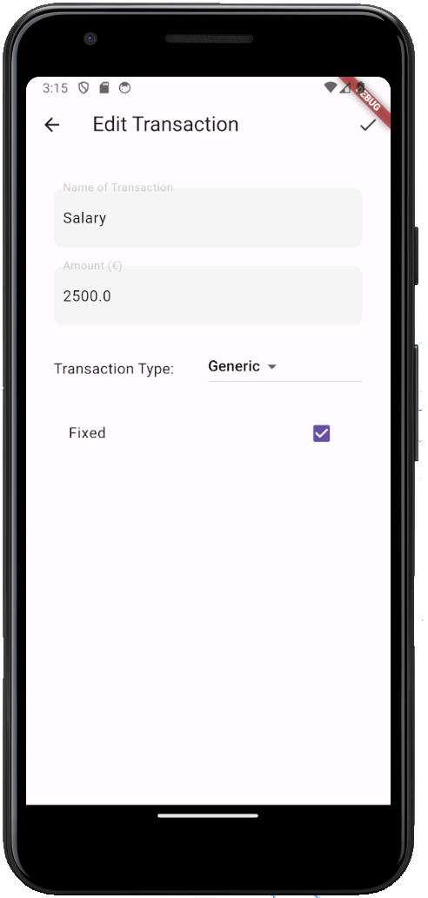

### Grafici
Se sono stati aggiungi dei dati nella pagina "History", accedendo alla pagina "Charts" verrà visualizzato un grafico con lo 
spaccato delle spese dell'utente nelle diverse categorie. Cliccando sul menu a discesa in alto, si può visualizzare invece lo stesso grafico ma per le entrate
 dell'account.

  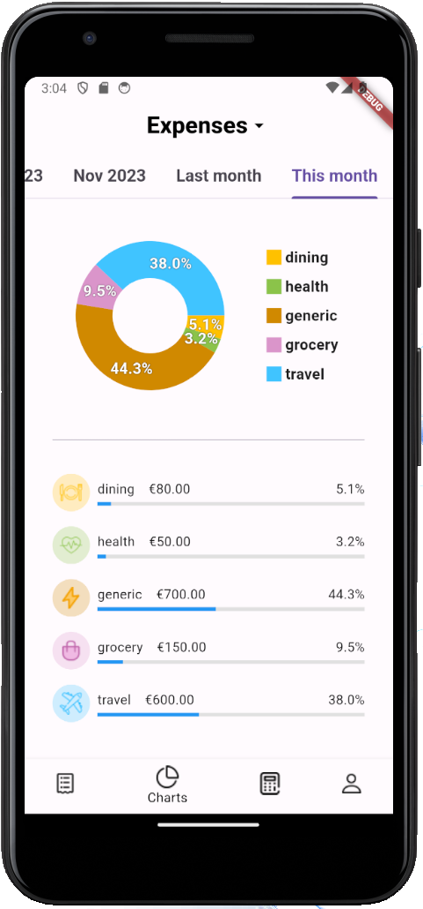

### Pianificazione finanziaria
Se l'utente non ha mai creato un piano finanziario, accedendo alla pagina "Budget" vedrà un pulsante "Create budget" per creare un nuovo piano. Cliccando sul
pulsante si viene portati alla pagina in cui è possibile selezionare la data di inizio e la data di fine della previsione finanziaria che si vuole fare, assieme 
al bilancio del mese iniziale. Una volta completato, si viene portati ad una sezione in cui si può compilare l'elenco delle transazioni previste, mese per mese, passando 
da un mese all'altro tramite scroll verso destra o sinistra. Infine, tornando alla pagina iniziale "Budget", non sarà più visualizzato il pulsante, 
ma una pagina che mostra l'andamento del piano dall'inizio alla fine, con profitto e bilancio di ogni mese. Cliccando sul pulsante di editing, l'utente può tornare alla schermata con
le transazioni previste per i vari mesi per effettuare eventuali modifiche, con la possibilità anche di modificare il periodo di budget. 

  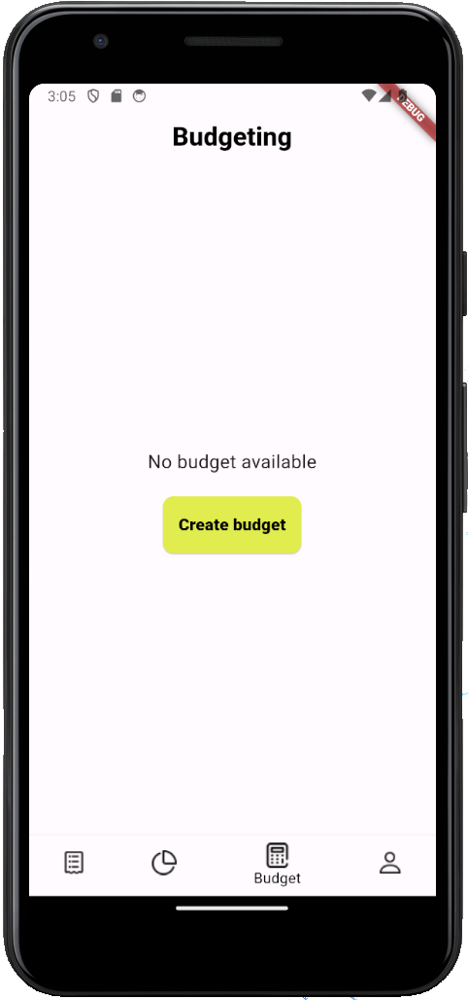
  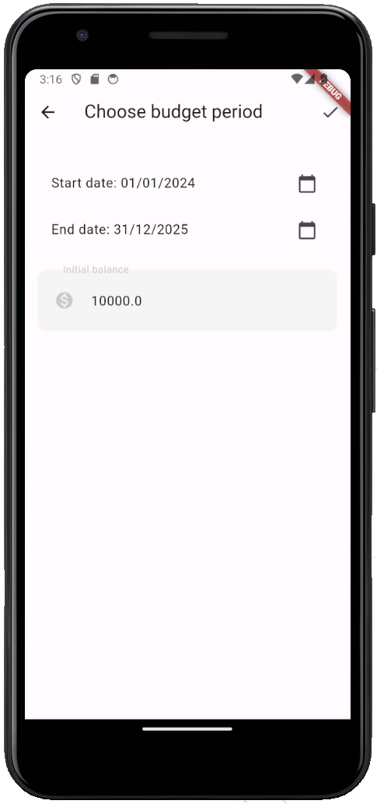
  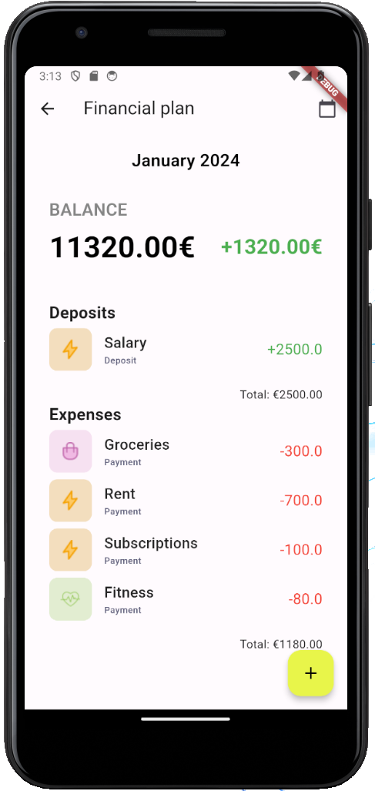
  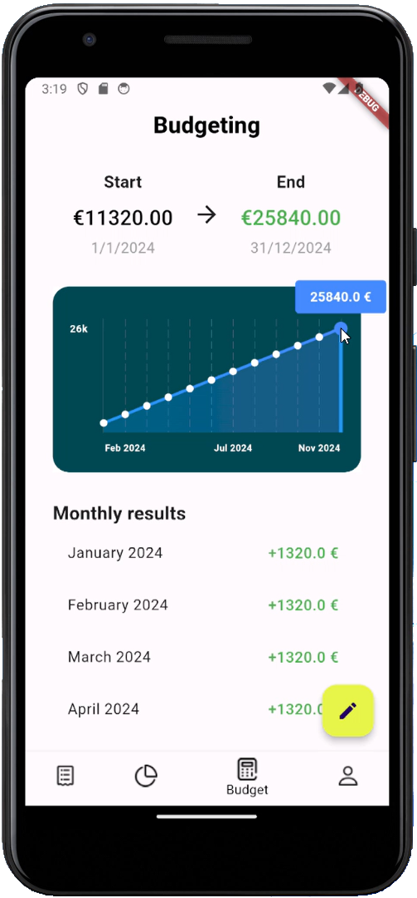

 
### Profilo
La pagina "Profile" mostra alcune informazioni dell'utente, come nome, cognome e email usata in fase di autenticazione. Se si è scelta la modalità di accesso 
con email e password, queste informazioni, nonchè la password, possono essere modificate tramite gli appositi pulsanti. E' possibile poi fare logout per tornare alla 
pagina di accesso.

  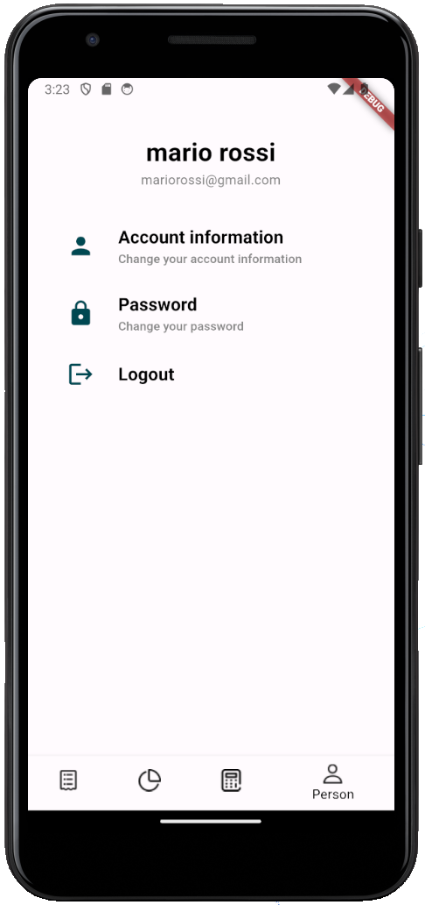
  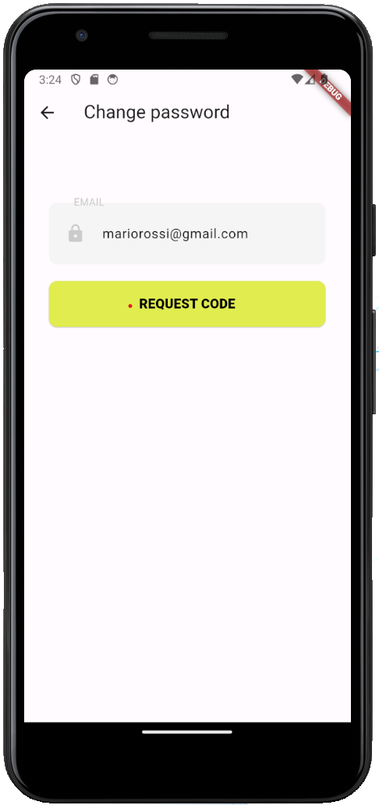
  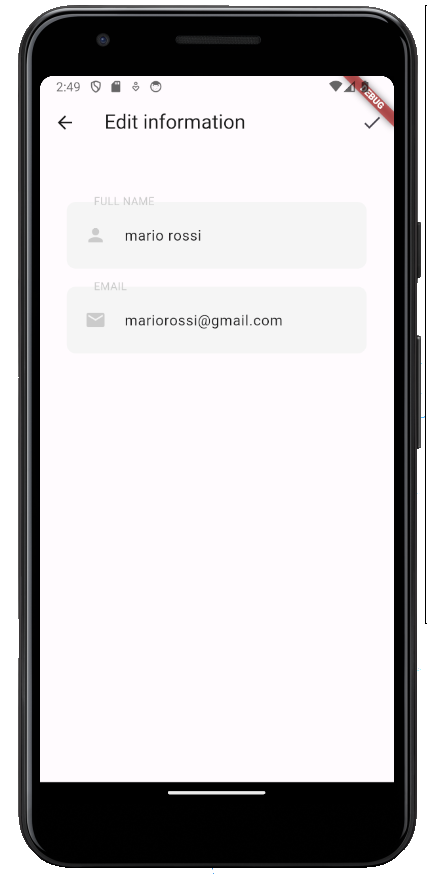

--- 

## Tecnologie
I pacchetti aggiuntivi principali utilizzati sono:
+ **firebase_core**, **firebase_auth**, **cloud_firestore**, **google_sign_in**: per utilizzare i servizi Firebase;
+ **fl_charts**: per la generazione dei grafici;
+ **uuid**: per la generazione di ID univoci lato client.

L'applicazione sfrutta **Firebase** come backend, che viene usato per implementare la logica di autenticazione tramite **Firebase Auth**, e la persistenza 
dei dati tramite il database **Firestore**. Sono stati forniti due metodi di autenticazione: autenticazione con Email e Password e Google Sign In. 

Il database è composto da 
una serie di raccolte e documenti. All'atto della registrazione, viene creato un nuovo documento all'interno della raccolta "**users**", impostando come nome lo
UID fornito dal servizio di autenticazione, in questo modo è possibile collegare ogni utente ai suoi dati su firestore. All'interno di ogni documento utente vengono inseriti due campi ("balance" ed "email") e vengono inizializzate 
due ulteriori raccolte:
+ **transactions**: contiene un documento per ogni transazione di storico inserita dall'utente;
+ **budget**: contiene diversi campi che caratterizzano un piano finanziario, come "startDate", "initialBalance" e una mappa "monthlyTransactions" contenente, per ogni mese, 
la lista di transazioni aggiunte per quel mese. 

Pe la gestione efficiente dello stato e delle chiamate HTTP sono stati adottati diversi costrutti Flutter, tra cui:
+ **FutureBuilder**: utilizzato per gestire le chiamate asincrone che richiedono un tempo di attesa per la risposta, gestendo in maniera efficace stati
 come il caricamento, gli errori e i dati ricevuti;
+ **ValueListenable**: utilizzato per ascoltare i cambiamenti di stato per specifici valori. Questo è particolarmente utile quando 
si verificano modifiche nei dati che non necessitano di una ricostruzione completa del widget;
+ **Streams**: tramite l'uso di StreamBuilder sono stati costruiti widget che reagiscono ai dati che arrivano in modo asincrono in 
un flusso continuo, come nel caso dei cambiamenti alla sessione di autenticazione dell'utente (Login, Logout, ecc..).

---

## Link
La demo dell'applicazione è raggiungibile dai seguenti link.

### Android

### Web